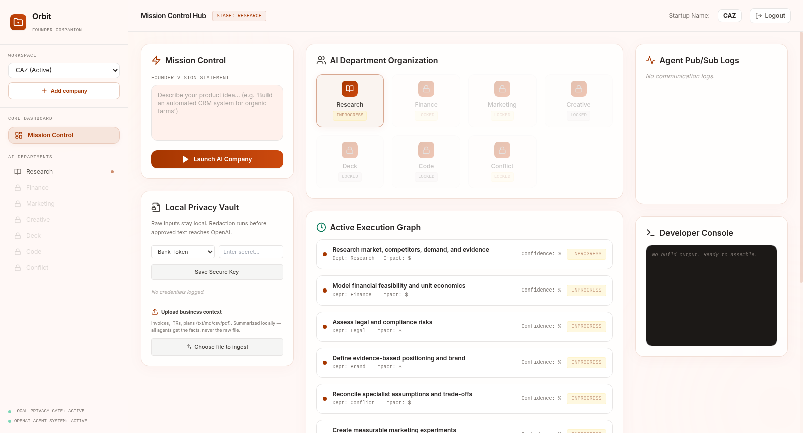
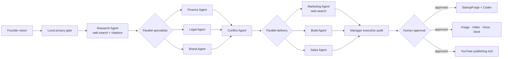
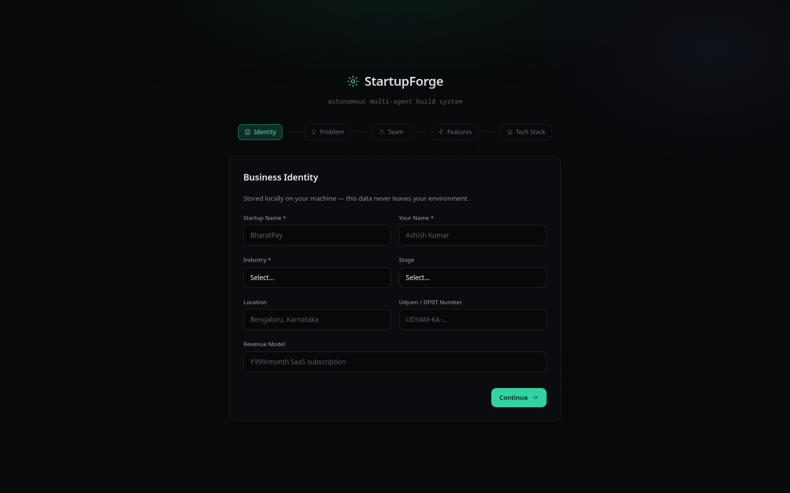

<div align="center">

# ORBIT

### Give us one startup idea. We assemble the company that executes it.

**An observable, privacy-aware OpenAI multi-agent founder workspace that researches a market, challenges assumptions, resolves specialist conflicts, generates a working product with Codex, and creates the launch campaign—including images, video, voiceovers, and pitch decks.**

[](https://developers.openai.com/)
[](https://developers.openai.com/codex/)
[](https://developers.openai.com/api/docs/models/gpt-image-2)
[](https://developers.openai.com/api/docs/models/sora-2)

</div>



## Why Orbit

Founders do not need another chatbot that returns a list of suggestions. They
need a coordinated operating system that can turn an incomplete idea into
evidence, decisions, execution, and launch assets—while leaving consequential
actions under human control.

Orbit makes the work visible. A founder enters a vision once. Mission Control
creates an execution graph, activates the right specialists in dependency
order, streams cross-agent activity, detects conflicting recommendations, and
hands an approved build specification to StartupForge. Every company has a
shared `StartupContext`, so specialists build on one another instead of starting
from an empty prompt.

## The multi-agent company

Orbit uses the OpenAI Agents SDK with a Manager that can invoke nine specialists
as tools. This is a real dependency graph—not nine independent chat windows.



| Agent | Responsibility | OpenAI capability |
|---|---|---|
| **Orbit Manager** | Delegates, audits the complete run, and reconciles the final company plan | Agents-as-tools, structured output, `gpt-5.6-sol` |
| **Research** | Market size, named competitors, pricing, demand signals, regulations | OpenAI web search with required citations |
| **Finance** | Runway, burn, unit economics, pricing and budget math | Validated Zod output, `gpt-5.6-sol` |
| **Legal** | Risks, compliance questions and qualified-counsel escalation | Guarded synthesis; no false legal certainty |
| **Brand** | Positioning, voice, visual direction and messaging | `gpt-5.6-terra` |
| **Conflict** | Compares incompatible specialist patches and makes trade-offs explicit | Cross-agent reconciliation, `gpt-5.6-sol` |
| **Marketing** | Evidence-backed GTM experiments, channels, CAC/LTV hypotheses and creative prompts | OpenAI web search + `gpt-5.6-terra` |
| **Sales** | ICP, qualification, outreach, pipeline stages and measurable targets | `gpt-5.6-terra` |
| **Support** | Onboarding, retention signals, escalation rules and feedback loops | `gpt-5.6-terra` |
| **Build** | Converts approved business context into an implementation-ready product specification | `gpt-5.6-sol`, then Codex SDK |
| **Creative & Voice** | Captions, scripts, poster briefs, voiceovers and launch assets | GPT Image 2, Sora 2 and `tts-1` |

`gpt-5.6-luna` handles fast summarization and privacy-safe document processing.
`gpt-4o-transcribe` is the configured speech-to-text path for the hardened voice
workflow. Model IDs are server-side configuration, so the orchestration is not
locked to one snapshot.

## From strategy to a working product

StartupForge is Orbit's execution arm. It receives a privacy-minimized business
profile only after approval, then maintains one resumable Codex thread per
build:

```text
Planner → Codex implementation → local build → Critic → Codex repair → diff/approval
```



Codex edits directly inside a validated generated-project directory. Absolute
paths and traversal are rejected; the project is snapshotted before edits;
build output and diffs are streamed; rollback is supported; and deployment or
GitHub publishing remains a separate, explicit human action.

## A marketing department that ships media

Orbit does not stop after writing campaign ideas. The Creative Studio persists
asynchronous `MediaJob` records and produces assets that the founder can inspect
and download.

<table>
<tr>
<td width="50%" valign="top">

### GPT Image 2 campaign poster

Generated from the shared CAZ brand and marketing context.


</td>
<td width="50%" valign="top">

### Sora 2 campaign video

An 8-second launch-ad demonstration generated through Orbit's asynchronous
Sora adapter. Click the frame to play/download the supplied MP4.

<a href="docs/assets/orbit-sora-ad.mp4"></a>

**[▶ Watch the Orbit-generated Sora ad](docs/assets/orbit-sora-ad.mp4)**

</td>
</tr>
</table>

The same studio includes:

- a **Creative & Voice Agent** for captions and sub-40-word voice scripts;
- real **OpenAI `tts-1` voiceover generation** with downloadable MP3 output;
- GPT Image poster generation and editing;
- Sora job polling with a storyboard + GPT Image still fallback when video
  access or venue connectivity is unavailable;
- structured ad storyboards and launch captions;
- investor-ready `.pptx` deck generation from live company context.

## Privacy and founder control

Orbit is designed around a local-first trust boundary:

- raw uploads remain local;
- deterministic redaction removes credentials, identity numbers, contacts and
  financial identifiers before an OpenAI call;
- prompt-injection boundaries treat uploaded documents as untrusted data;
- only validated structured patches can mutate `StartupContext`;
- runs persist trace IDs, usage, citations, tool calls, output and errors;
- publishing, deployment, spending, filings, public claims and repository writes
  require explicit human approval;
- YouTube remains behind Google OAuth because it is the publishing destination,
  while business reasoning, code and media generation use OpenAI.

## Repository map

```text
Orbit/
├── Orbit-main/       Founder workspace, shared context, Agents SDK graph,
│                     privacy gate, approvals and creative/voice studio
├── startupforge/     Codex SDK generation, review, repair, diff and rollback
├── MultiVideo/       OAuth-backed YouTube publishing boundary
├── docs/assets/      Evaluator screenshots and generated demo media
└── whathappendtillnow.md  Credential-safe engineering audit trail
```

## Five-minute evaluator path

1. Create a company and private password from the Orbit landing screen.
2. Enter a founder vision and launch the AI company.
3. Watch Research run first, then Finance/Legal/Brand in parallel.
4. Inspect citations, structured decisions, trace/usage records and pub/sub logs.
5. Let Conflict reconcile contradictions before Marketing/Build/Sales execute.
6. Approve the StartupForge handoff and watch the resumable Codex build stream.
7. Review the generated diff and repair loop.
8. Generate a poster, Sora ad/storyboard, voiceover and pitch deck.
9. Confirm that publishing cannot happen without founder approval.

## Run locally

### Orbit

```bash
cd Orbit-main
cp packages/server/.env.example packages/server/.env
# Add OPENAI_API_KEY and locally generated secrets to the untracked .env.
npm install
npm run dev
```

Orbit opens at `http://localhost:3000`; its API runs at
`http://localhost:5000`. A production Dockerfile serves both from one service.

### StartupForge

```bash
cd startupforge/server
cp .env.example .env
# Add OPENAI_API_KEY, STARTUPFORGE_SERVICE_TOKEN and the encryption key.
npm install
npm run dev

# second terminal
cd ../client
npm install
npm run dev
```

StartupForge opens at `http://localhost:5173`; its API runs at
`http://localhost:3001`. Use the same high-entropy
`STARTUPFORGE_SERVICE_TOKEN` in both server environments. Secrets and real
credentials must never be committed.

## Verification already in the repository

- agent graph ordering and parallelism;
- Manager specialist-tool invocation;
- structured-output and finance validation;
- citation and unsafe-legal-claim gates;
- PII/credential redaction and prompt-injection isolation;
- approval enforcement;
- Codex thread resumption, path containment, diff and rollback;
- canonical + compatibility build events;
- media jobs, Sora fallback and YouTube approval behavior;
- full Node builds and a combined frontend/backend Docker smoke test.

---

<div align="center">

### Orbit turns “I have an idea” into “my company is executing.”

Built as a multi-agent founder operating system with the **OpenAI Agents SDK,
Codex SDK, GPT-5.6 family, GPT Image 2, Sora 2, OpenAI voice/TTS, and web search**.

</div>
